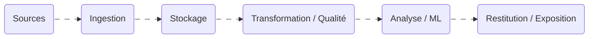

{.w-30.mt--10.mb-5}

---
layout: intro
class: pl-25
glowSeed: 14
---

Guillaume Gandon

*]:important-leading-10 opacity-80 mt5">
Lead Data Engineer 

---
layout: center
glow: top
class: text-center
hideInToc: true
---

# Acculturation Data

  

  
3 mars 2026

---
transition: fade-out
hideInToc: true
---

# Sommaire

<Toc text-sm minDepth="1" maxDepth="2" />

---
transition: slide-up
---

# 🎯 Objectifs de la présentation

**Pourquoi cette présentation ?**

* Démystifier la Data (ce n’est pas “juste des dashboards” ni “de la magie IA”)
* Donner un **langage commun** entre tech & commerce
* Aider les commerciaux à :

  * qualifier un besoin client
  * identifier **le bon pilier**
  * placer **le bon profil**

👉 Message clé :

> *La Data est une chaîne de valeur, pas un outil isolé.*

---
transition: slide-up
---

# 🧠 Vue d’ensemble : le parcours de la donnée

  
Sources

  

  
Ingestion

  

  
Stockage

  

  
Transformation / Qualité

  

  
Analyse / ML

  

  
Restitution / Exposition

💡 Important :
> *Si une étape est mal faite, tout ce qui suit est impacté.*

---
hide: true
---

# 🧠 Vue d’ensemble : le parcours de la donnée

💡 Important :
> *Si une étape est mal faite, tout ce qui suit est impacté.*

---
transition: slide-up
layout: two-cols-header
level: 2
---

# Étape 1 – Ingestion des données

::left::

🗂️ **Sources possibles**

* ERP (SAP, Sage…)
* CRM (Salesforce, HubSpot)
* APIs
* Fichiers (CSV, Excel, Json, XML)
* IoT / logs

🔑 **Mots-clés**

* Batch vs Temps réel
* ETL / ELT
* Connecteurs

::right::

🛠 **Outils**

* Airflow • Talend • Kafka • APIs REST

💼 **Cas concret**

> *Ingestion quotidienne des transactions pour détecter les fraudes et avoir une vue client 360°.*

<!--
Message commercial : “Un client qui a beaucoup d’Excel = opportunité.”
-->

---
transition: slide-up
layout: two-cols-header
level: 2
---

# Étape 2 – Stockage & Plateforme Data

::left::

💡 **Concepts**

* Data Lake
* Data Warehouse
* Lakehouse

🛠 **Outils**

* BigQuery, Snowflake, Redshift
* Azure Data Lake, S3
* Hadoop / Cloudera
* Databricks

::right::

💼 **Cas concret**

> *Une banque centralise et sécurise ses données clients, transactions et risques pour répondre aux besoins métier et réglementaires.*

<!--
Message commercial : modernisation d’architecture.
-->

---
transition: slide-up
layout: two-cols-header
level: 2
---

# Étape 3 – Transformation & Qualité

::left::

🎯 **Objectifs**

* nettoyer
* standardiser
* historiser
* fiabiliser

🔑 **Mots-clés**

* Modélisation
* Qualité de données
* Traçabilité
* Tests

::right::

🛠 **Outils**

* dbt
* Spark

💼 **Cas concret**

> *Chiffre d’affaires différent entre Finance et Commerce → problème de règles métiers.*

<!--
Message : dette technique = besoin de structuration. Industrialisation
-->

---
transition: slide-up
layout: two-cols-header
level: 2
---

# Étape 4 – Analyse & Machine Learning

::left::

🎯 **Objectifs**

* Prédiction de pannes
* Scoring client
* Détection de fraude
* Prévision des ventes
* Recommandation produit

🔑 **Mots-clés**

* Features
* Entraînement
* Modèle
* Prédiction

::right::

🛠 **Outils**

* Python, Pandas, Scikit-learn
* TensorFlow / PyTorch
* MLflow

💼 **Cas concret**

> *Une banque prédit le risque de défaut d’un client pour sécuriser et accélérer l’octroi de crédits.*

---
layout: two-cols-header
level: 2
---

# Étape 5 - Restitution & Exposition

::left::

🎯 **Objectif**

Rendre la donnée accessible et utile aux métiers ou aux applications.

🔑 **Mots-clés**

Dashboard • Reporting • API • Export • Partage sécurisé

::right::

🛠 **Outils**

Power BI • Tableau • APIs • Cloud

💼 **Cas concret**

> *Une banque met en place un tableau de bord pour suivre les risques et fournit les données aux applications mobiles via API.*

---

# Les rôles dans l’écosystème Data

---
transition: slide-up
level: 2
---

# 🔧 Data Engineer

* Construit les pipelines
* Gère le stockage
* Travaille sur la performance

👉 Profil technique, infra, cloud.

---
transition: slide-up
level: 2
---

# 📊 Data Analyst

* Produit les dashboards
* Analyse la performance
* Travaille avec les métiers

👉 Souvent rattaché au métier.

---
transition: slide-up
level: 2
---

# 🤖 Data Scientist

* Modèles prédictifs
* Machine learning
* Cas d’usage avancés

👉 Projet à forte valeur mais dépendant de la maturité data.

---
transition: slide-up
level: 2
---

# 🏛️ Data Steward

* Garant de la qualité des données
* Définitions des KPI
* Documentation

👉 Sujet clé dans les grandes entreprises.

---
transition: slide-up
level: 2
---

# 👔 Data Owner

* Responsable métier d’un domaine de données
* Porte la vision et la valeur

👉 Souvent décisionnaire ou sponsor.

---
level: 2
---

# 🧭 Chief Data Officer

* Stratégie data globale
* Gouvernance
* Budget

---
class: text-2xl
glow: right
transition: slide-up
---

# 🧩 Les 4 piliers Osmose

  

    

    Data Engineering & Plateformes
  

  

  
Ingestion, Transformation, Stockage

  

    

    Data Analytics & Visualisation
  

  

  
Analyse, Dashboard

  

    

    Data Science / ML / IA
  

  

  
Enrichissement, Prédiction

  

    

    Accompagnement & Pilotage
  

  

  
Transversal, du cadrage à la prod

---
preload: false
---

<ViteEco />

---
layout: intro
class: text-center pb-5
glowX: 50
glowY: 120
---

<h1 font-jp important-text-3em>Merci</h1>
